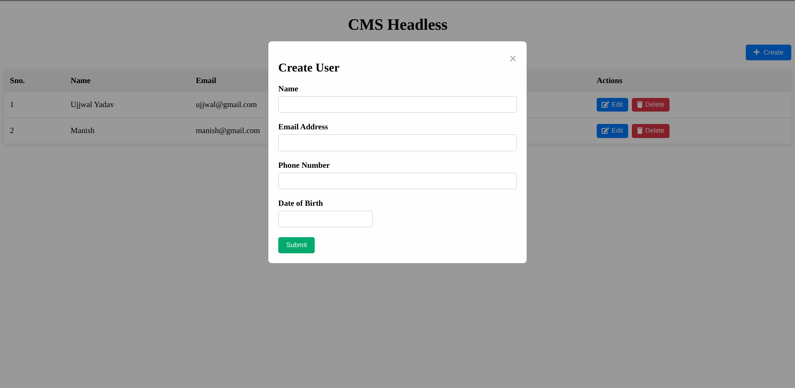
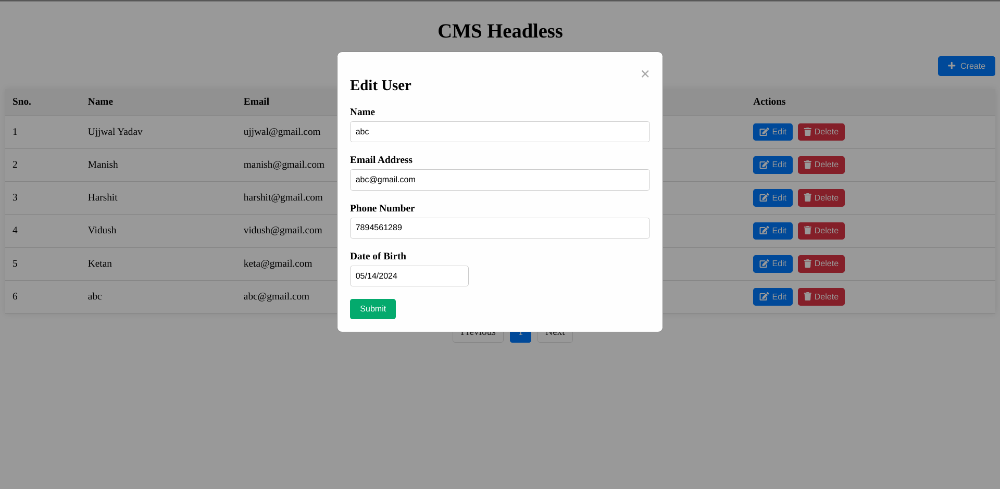
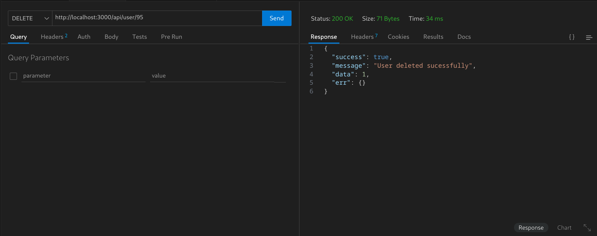

# CMS Headless

## Dependecies and Tools
-  REACT JS
-  NODE JS
-  EXPRESS
-  MySQL

This project consists of two main folders: `Frontend` and `backend`, each of which needs to be run separately.

## Setup Instructions

Follow these steps to set up the project:

1. **Clone the Repository:**

   ```bash
   git clone <repository_url>
   cd cms-headless

   ```

## Starting Backend (will run on http://localhost:3000/)

#### **Install Dependencies:**

```bash
npm i
```

####  **Database Configuration:**
    Create a MySQL database named cms-headless.

```bash
npx sequelize db:create
```

####  **Database Migration:**

```bash
npx sequelize db:migrate
```

#### **Run the Application:**

```bash

npm start

```

#### **API Endpoints**

/user (POST): Add a new user.

/user (GET): Get all user details

/user/:id (PUT): Edit the particular user detail.

/user/:id (DELETE): Delete the particular user.


## Starting Frontend (will run on http://localhost:5173/)

#### **Install Dependencies:**

```bash
npm i
```

#### **Run the Application:**

```bash

npm run dev

```

## Functionalities added

1. **Tables View**
2. **Pagination**
3. **Handled Edge cases in backend as well as in frontend**
4. **Toast Messages to User**

## Screenshots
1. Creating User


2. Created Sucessfully


3. Validations


4. Editing



5. Deleting


6. Showing error of duplicate email or phone number


7. Pagination with 10 items in first page


### Api responses

1. Create


2. Get


3. Update


4. Delete





